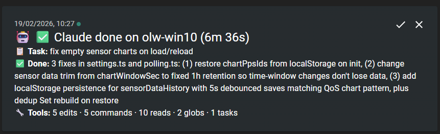

# claude-ntfy.sh

**Get push notifications on your phone when Claude Code finishes work, needs permission, or is waiting for input.**

Stop watching the terminal. Let Claude tell you when it's done.



## Why?

Claude Code can run for minutes on complex tasks. With `claude-ntfy.sh` you get a rich push notification the moment something happens — so you can context-switch freely and come back exactly when needed.

- **Task completed** — see what was done, how long it took, and which tools were used
- **Permission needed** — approve tool execution from your phone without switching back to the terminal
- **Waiting for input** — know instantly when Claude needs you (optional)

Notifications are only sent when a task exceeds a configurable duration threshold (default: 30s), so quick interactions stay silent.

## Quick start

### 1. Set up ntfy.sh

1. Install the **ntfy app** on your phone — [Android](https://play.google.com/store/apps/details?id=io.heckel.ntfy) · [iOS](https://apps.apple.com/app/ntfy/id1625396347)
2. Create a free account at [ntfy.sh](https://ntfy.sh/app)
3. Create a **topic** (use something unique and hard to guess — it's your notification channel)
4. Create an **access token** under *Account > Access tokens*
5. Subscribe to your topic in the app

### 2. Run the installer

```bash
bash setup-claude-ntfy.sh --topic "your-unique-topic" --token "tk_your_token"
```

That's it. The script installs everything into `~/.claude/` and is fully idempotent — run it again anytime to update settings.

### Options

| Flag | Description | Default |
|------|-------------|---------|
| `--topic` | Your ntfy topic (required) | — |
| `--token` | Your access token (required) | — |
| `--threshold` | Seconds before a notification fires | 30 |
| `--server` | Self-hosted ntfy server URL | https://ntfy.sh |
| `--idle` | Enable idle/waiting-for-input notifications | off |
| `--no-permission` | Disable permission-request notifications | — |

## How it works

The installer creates four files under `~/.claude/`:

| File | Purpose |
|------|---------|
| `hooks/ntfy-config.env` | Your settings (chmod 600) |
| `hooks/ntfy-notify.sh` | The hook script — shared by all event types |
| `settings.json` | Registers hooks (existing settings preserved) |
| `CLAUDE.md` | Tells Claude to include a summary marker in every response |

Claude Code's hook system pipes session data to the script, which parses the transcript, calculates duration, counts tool usage, and sends a rich notification via the ntfy API.

## Security

Notifications go to an external server, so sensitive data is protected by two layers:

1. **Prompt-level** — Claude is instructed to never include secrets in notification summaries
2. **Code-level** — A regex scrubber catches known token formats (GitHub, Stripe, AWS, Slack, JWTs, SSH keys, etc.) and `key=value` patterns with secret-like names, replacing matches with `[REDACTED]`

## Requirements

- `bash` + `python3`
- A free [ntfy.sh](https://ntfy.sh) account (or self-hosted ntfy server)

## License

MIT
